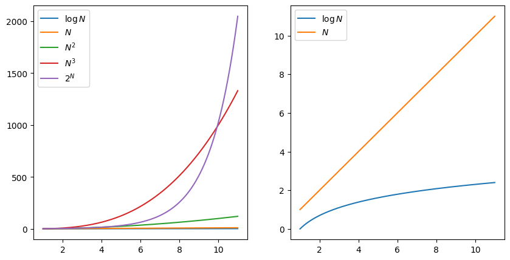
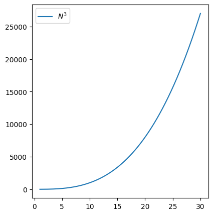
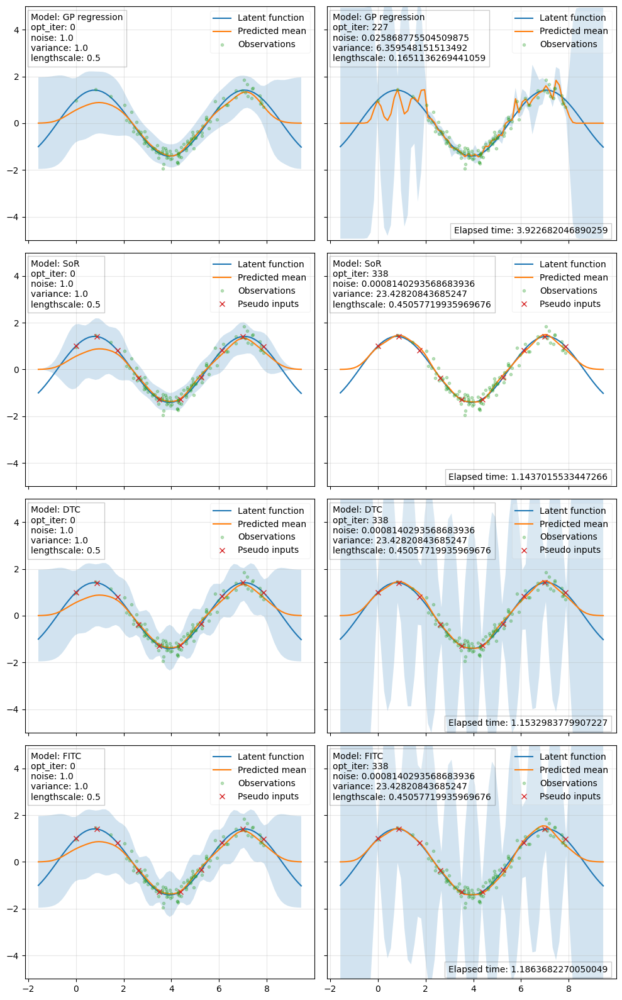
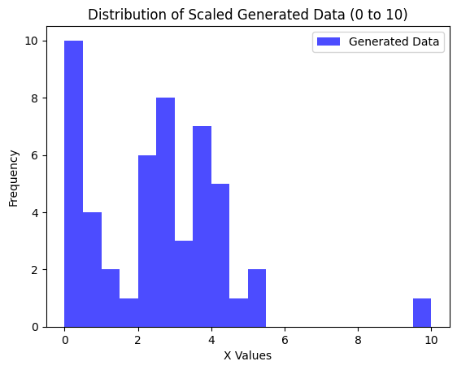
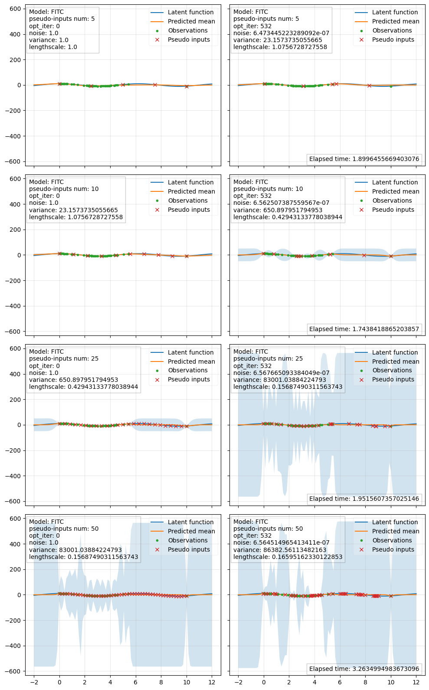
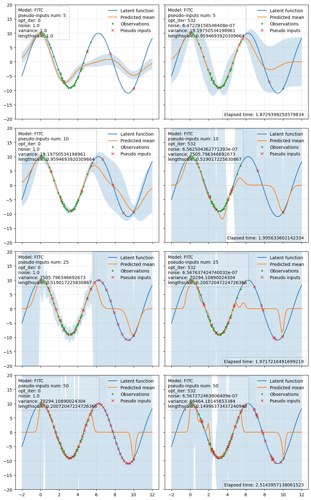

# スパースガウス過程回帰の実装

- **目次**

作成者 Onoue Keisuke

作成日 2023/08/19

実装コード全体は，[github のリポジトリ](https://github.com/k-onoue/sgpr)に置いています。

# 0. 導入

前回の記事ではガウス過程回帰を効率的に行うためのアルゴリズムであるスパースガウス過程回帰を紹介しました。前回の記事でもふれた通り、ガウス過程は理論的には美しいものの、通常データ点が1000をこえてくると逆行列の計算がボトルネックになってしまい、実用で使うのは難しいという課題がありました。スパースガウス過程では補助変数法等を導入し、大幅に計算量を削減しようというものです。今回の記事では、そもそも計算量とはなにかを紹介してから、実際にスパースガウス過程回帰の実装を行ってみたいと思います。また計算量を落とすだけでなく、いかに精度を落とさないかの「トライも行なっていきます。

# 1. 計算量

## 1.1 計算量とは

計算量とは、あるアルゴリズムがどの程度の計算資源（時間や領域）を必要とするかを評価する指標です。

計算量は、主に次の２つの指標を用いて評価します。

- 時間計算量： アルゴリズムが問題を解くために必要な時間を評価する指標
- 領域計算量： アルゴリズムが必要とするメモリ領域の量を評価する指標

また、計算量は、次の3つの場合に分けて評価されることがあります。

- 最善計算量： アルゴリズムが最も効率的に動作する場合の計算量
- 平均計算量： アルゴリズムが入力データの分布に基づいて平均的にどの程度の計算量が必要化を表す
- 最悪計算量： アルゴリズムが最も効率的でない場合の計算量

当然ながらコンピュータの計算速度には限界があるので、書いたプログラムが現実的な時間内に終了するかを見積もることは大変重要です。

## 1.2 $O$ 記法（オーダー表示）

$O$ 記法とは、アルゴリズムの計算量を表す記法の一つで、最悪計算量を表します。

ここで、 $f(N)$ を入力サイズ $N$ に対するアルゴリズムの計算量、 $g(N)$ を関数とすると、ある定数 $c$ が存在して $N$ がどこまで大きくなっても $f(N) \leq c \times g(N)$ となるとき、そのアルゴリズムの計算量を $O(g(N))$ と表現します。 $f(N)$ は $g(N)$ の定数倍で上から抑えられるという意味です。

実際によく見かけるものを計算量が大きいもの、つまり、遅いものから順に並べてみると

$$
O(N!) > O(2^N) > O(N^3) > O(N^2) > O(N \log N) > O(N) > O(\log N) > O(1)
$$

のようになります。グラフで比較するとよりわかりやすいです。



## 1.3 逆行列の計算量

補助変数法はガウス過程回帰における、いかにして入力点数の大きい行列に対する逆行列の計算を回避するかという課題へのアプローチの１つです。

$N \times N$ の行列をメモリに格納するメモリ消費量、つまり領域計算量は $O(N^2)$ で、その逆行列を求めるための演算数、つまり時間計算量は $O(N^3)$ となります。



データ点数が増えると、計算量が急激に増加することがグラフから分かります。しかし、データ点数が少なければ少ないほど、より確実に現実的な時間内で計算が完了できます。補助変数法を用いると、実際のデータ点数が $N$ 個にガウス過程回帰モデルを適用したい場合でも、 $M << N$ 個の疑似入力点を用いて計算量を削減することができます。

# 2. 実装の全体像

本記事でのガウス過程回帰の実装は，”[A Unifying View of Sparse Approximate Gaussian Process Regression](https://scholar.google.com/scholar?hl=ja&as_sdt=0%2C5&q=a+unifying+view+of+sparse+approximate+gaussian+process+regression&btnG=)” という論文をベースとします．そのため，以前私が書いたガウス過程回帰の記事とは数式の表記方法などが少し異なっています．

補助変数法の流儀は複数あるのですが，上記の論文では，それらが同時事前分布共分散行列（joint prior covariance）への近似という観点から統一的に解説されています．

今回は，

- 通常のガウス過程回帰（以降 GPとする）
- Subset of Regressors (SoR)
- Deterministic Training Conditional (DTC)
- Fully Independent Training Conditional (FITC)

を実装します．

上記の４つのアルゴリズムに対して，共通で以下の予測分布 (1) と対数周辺尤度 (2) の式が使えて， $\bold u, \Sigma, \Lambda$ のそれぞれに代入するものの違いによって実装するアルゴリズムを変更できます．

$$
\begin{align}
p(\bold f_*|\bold y) 
&=\mathcal N(
K_{*, \bold u} \Sigma K_{\bold u, \bold f} \Lambda^{-1} \bold y, 
P_{*,*} - K_{*, \bold u} K_{\bold u, \bold u}^{-1}K_{\bold u,*} + K_{*, \bold u}\Sigma K_{\bold u,*}
) 
\end{align}
$$

$$
\begin{align*}
\log q(\bold y | X_{\bold u})
&= - \frac{1}{2} \log(|K_{\bold u, \bold u} + K_{\bold u, \bold f} \Lambda^{-1} K_{\bold f, \bold u}||K_{\bold u, \bold u}^{-1}||\Lambda|) \\[5pt]
&\quad\quad - \frac{1}{2} \bold y^\top \Lambda^{-1} (I + K_{\bold f, \bold u} \Sigma K_{u, f} \Lambda^{-1}) \bold y - \frac{n}{2} \log(2 \pi) \tag{2} 
\end{align*}
$$

ただし，ここで $Q_{\bold a, \bold b} = K_{\bold a, \bold u} K_{\bold u, \bold u}^{-1} K_{\bold u, \bold b}$ となります．下の表が各アルゴリズムによって代入する値となります．

|  | $\bold u$ | $\Sigma$ | $\Lambda$ | $P_{*,*}$ |
| --- | --- | --- | --- | --- |
| GP | $\bold f$ | $(K_{\bold f, \bold f} + K_{\bold f, \bold f} \Lambda^{-1} K_{\bold f, \bold f} )^{-1}$ | $\sigma^2 I$ | $K_{*,*}$ |
| SoR | $\bold u$ | $(K_{\bold u, \bold u} + K_{\bold u, \bold f} \Lambda^{-1} K_{\bold f, \bold u} )^{-1}$ | $\sigma^2 I$ | $Q_{*,*}$ |
| DTC | $\bold u$ | $(K_{\bold u, \bold u} + K_{\bold u, \bold f} \Lambda^{-1} K_{\bold f, \bold u} )^{-1}$ | $\sigma^2 I$ | $K_{*,*}$ |
| FITC | $\bold u$ | $(K_{\bold u, \bold u} + K_{\bold u, \bold f} \Lambda^{-1} K_{\bold f, \bold u} )^{-1}$ | $\text{diag}{[K_{\bold f, \bold f} - Q_{\bold f, \bold f} + \sigma^2 I]}$ | $K_{*,*}$ |

 上に基づき，まずは共通の部分を `_base_gp` クラスとして作成します．

```python
class _base_gp():
    def __init__(self, X_train, y_train, kernel=None, noise=1.):
        self.X_train = X_train.requires_grad_(True)
        self.y_train = y_train.requires_grad_(True)
        noise = np.log(noise)
        self.noise = torch.tensor(noise, requires_grad=True)

        if kernel is None:
            kernel = RBF()
        self.kernel = kernel

        self.params = [self.noise, self.kernel.variance, self.kernel.lengthscale]

        self.params_opt_results = []

    def _calc_misc_for_prediction(self, X_pred):
        X_pred = X_pred
        K_us = None
        K_su = K_us.T
        K_uu = None
        i_K_uu = inv(K_uu) 
        Sigma = None
        K_uf = None
        i_Lambda = None
        P_ss = None
        return K_us, K_su, i_K_uu, Sigma, K_uf, i_Lambda, P_ss
    
    def predict(self, X_pred):
        K_us, K_su, i_K_uu, Sigma, K_uf, i_Lambda, P_ss = self._calc_misc_for_prediction(X_pred)
        y = self.y_train
        mean = K_su @ Sigma @ K_uf @ i_Lambda @ y
        cov = (P_ss - K_su @ i_K_uu @ K_us) + K_su @ Sigma @ K_us
        return mean, cov

    def _calc_misc_for_optimization(self):
        K_uu = None
        i_K_uu = None
        K_uf = None
        K_fu = K_uf.T
        Lambda = None
        i_Lambda = None
        Sigma = None
        return K_uu, i_K_uu, K_uf, K_fu, Lambda, i_Lambda, Sigma

    def _log_marginal_likelihood(self):
        K_uu, i_K_uu, K_uf, K_fu, Lambda, i_Lambda, Sigma = self._calc_misc_for_optimization()
        y = self.y_train
        n = y.shape[0]
        I = torch.eye(n)
        term1 = - (1/2) * log(det(K_uu + K_uf @ i_Lambda @ K_fu) * det(i_K_uu) * det(Lambda)) 
        term2 = - (1/2) * y.T @ i_Lambda @ (I + K_fu @ Sigma @ K_uf @ i_Lambda) @ y 
        term3 = - (n/2) * log(torch.tensor(2 * pi))
        return term1 + term2 + term3
        
    
    def optimize(self, iteration=10, learning_rate=0.1):
        optimizer = torch.optim.Adam(self.params, lr=learning_rate) 

        self._store_params()

        for i in range(iteration):
            print(f'opt_iter: {i+1}/{iteration}')

            optimizer.zero_grad()

            try:
                loss = self._log_marginal_likelihood()
                # loss = - self._log_marginal_likelihood()
                loss.backward()
                optimizer.step()

                self._store_params()

            except Exception as e:
                print(f"An error occurred during optimization: {e}")
                print("Using previous parameters and ending optimization.")
                
                tmp1 = self.params_opt_results[i-1][:3]
                self.noise = torch.tensor(tmp1[0], requires_grad=True)
                self.kernel.variance = torch.tensor(tmp1[1], requires_grad=True)
                self.kernel.lengthscale = torch.tensor(tmp1[2], requires_grad=True)
                
                for j, new_param in enumerate([self.noise, self.kernel.variance, self.kernel.lengthscale]):
                    self.params[j] = new_param
                
                if len(self.params) > 3:
                    tmp2 = self.params_opt_results[i-1][3:]
                    self.pseudo_inputs = torch.Tensor(tmp2).reshape(-1, 1).requires_grad_(True) 
                    self.params[3] = self.pseudo_inputs  
                
                break
```

あとはアルゴリズムごとに継承してクラスを作成する際に， `_calc_misc_for_prediction` メソッドと `_calc_misc_for_optimization` メソッドをオーバーライドすれば完成です．下は GP の例です． GP の場合は近似をしないので，補助変数 $\bold u$ が $\bold f$ となります．

```python
class GP(_base_gp):
    def __init__(self, X_train, y_train, kernel=None, noise=1.):
        super().__init__(X_train, y_train, kernel, noise)
    
    def _calc_misc_for_prediction(self, X_pred):
        f = self.X_train
        u = self.X_train
        s = X_pred
        noise = exp(self.noise)

        K_us = self.kernel.K(u, s)
        K_su = K_us.T
        K_uu = self.kernel.K(u, u)
        i_K_uu = inv(K_uu)
        K_uf = self.kernel.K(u, f)
        K_fu = K_uf.T
        K_ss = self.kernel.K(s, s)

        Lambda = noise * torch.eye(f.shape[0])
        i_Lambda = inv_diag(Lambda)
        i_Sigma = K_uu + K_uf @ i_Lambda @ K_fu
        Sigma = inv(i_Sigma)

        P_ss = K_ss

        return K_us, K_su, i_K_uu, Sigma, K_uf, i_Lambda, P_ss

    def _calc_misc_for_optimization(self):
        f = self.X_train
        u = self.X_train
        noise = exp(self.noise)
        
        K_uu = self.kernel.K(u, u)
        i_K_uu = inv(K_uu)
        K_uf = self.kernel.K(u, f)
        K_fu = K_uf.T

        Lambda = noise * torch.eye(f.shape[0])
        i_Lambda = inv_diag(Lambda)
        i_Sigma = K_uu + K_uf @ i_Lambda @ K_fu
        Sigma = inv(i_Sigma)

        return K_uu, i_K_uu, K_uf, K_fu, Lambda, i_Lambda, Sigma
```

# 3. 実際に計算してみた

今回は以下の３点について，実際に計算をして結果を眺めてみることとします．

1. 実装したアルゴリズムごとの違い
2. 補助入力点数が違うとどうなるのか
3. 補助入力点の位置の最適化

## 3.1 各アルゴリズム間の違い

上から順に， GP，SoR，DTC，FITC となっています．最適化アルゴリズムは Adam で，学習率は 0.01 ，イテレーション数は大体 200 ~ 300 程度となっており，スパース近似モデルの補助入力点数は 10 となっています．観測データの数は全実験共通で 100 となり，カーネル関数も全実験共通で初期パラメータが variance が 1.0，lengthscale が 0.5 のRBF カーネルです．

次の実験の結果も合わせて考えると，補助入力点数が少なすぎると近似モデルは自分の予測に対して少々自信過剰になる傾向があるようです．

FITC と DTC は SoR に比べて，その傾向が弱いと言えそうです．



## 3.2 補助入力点の数の違いによる予測の差

この実験では，補助入力点数の違いによる差を見ていきます．

モデルは FITC で，補助入力点はそれぞれ上から 5，10，25，50 個となっています．


これを見ると，補助入力点数が 25 の時点でだいぶ良い近似ができているのではないかと思います．最適化と予測を合わせた時間が， GP の場合の約 4 秒（実験 3.1 の右上のグラフを参照）と比較すると，約 1.3 秒なので計算時間なのでまずまずの結果と言えそうです．

しかし，補助入力点数が 50 のときは約 5.7 秒となっているのに加えて，観測データ生成のランダムネスを除いた同条件での実験を複数回行ったところ，結構ばらつきはありそうです．

## 3.3 補助入力点の位置を最適化してみる

上の２つの実験でも一応補助入力点の位置も同時に最適化をしているのですが，観測データと補助入力点はともに定義域にほぼ均等に配置されています．そのため，最適化後でもあまり位置に変化は見られません．

そこで，ここでは不均一に分布している観測データに対してスパース近似モデルを適用し，補助入力点の位置の最適化を行います．

ここでもモデルは FITC を採用します．

観測データの入力点のヒストグラムは以下のようになります．





正直なんとも言えませんが，補助入力点が観測データが多く分布している方へ頑張って移動しようとしていることは確認できると思います．

今回の全実験を通して，カーネル関数には RBF カーネルを採用しましたが，他にもたくさんの種類のカーネル関数が存在するので，別のものを使用するともっと良い結果が得られたかもしれません．

# 4. 補足

サイズの大きい行列の逆行列と行列式を直接求めることを回避するために使用される式変形方法として，逆行列の補題と行列式の補題があります．証明は Wikipedia に載っています．

## 4.1 逆行列の補題（Woodbury matrix identity）

$A, C, U, V$ をそれぞれ $n \times n, k \times k, n \times k, k \times n$ の行列であるとします． $A, C$ は正則（逆行列が存在する）とすると，以下の式が成り立ちます．

$$
(A + UCV)^{-1} = A^{-1} - A^{-1}U(C^{-1} + VA^{-1}U)^{-1}VA^{-1}
$$

ぱっと見た感じ，恩恵がわかりにくいのですが， $n >> k$ で， $A^{-1}$ が既知である場合では $n \times n$ の逆行列を求める操作を回避することができます．

## 4.2 行列式の補題（Matrix determinant lemma）

$A, W, U, V$ をそれぞれ $n \times n, k \times k, n \times k, k \times n$ の行列であるとします． $A, W$ は正則であるとすると，以下の式が成り立ちます．

$$
\det(A + UWV) = \det(W^{-1} + V A^{-1}U) \det(W) \det(A)
$$

ここでも， $n >> k$ で， $A$ が対角行列であるときなどに威力を発揮します．

## 4.3 各アルゴリズムの式の導出

式 (1)，(2) はそれぞれ各種近似アルゴリズムの性能を間違いなく発揮するために

### 4.3.1 予測分布の式

平均を $\bold 0$ と仮定した上で，同時事前共分散行列の周辺化によって予測分布の式が得られます．

ただし，下の表からわかる用に，近似を施したアルゴリズムの予測分布でさえも，元と同じサイズの対角行列ではない行列の逆行列を求めなければならず，これでは計算コストの削減になっていません．そこで，上で紹介した逆行列の補題を使用して式変形します．

|  | 同時事前分布共分散行列 | 予測分布の式 |
| --- | --- | --- |
| GP | $\begin{pmatrix}K_{\bold f, \bold f} & K_{\bold f,  *} \\K_{ *, \bold f} & K_{*,  *}\end{pmatrix}$ | $\mathcal N(K_{*, \bold f} (K_{\bold f, \bold f} + \sigma^2 I)^{-1} \bold y, K_{*, *} - K_{*, \bold f} (K_{\bold f, \bold f} + \sigma^2 I)^{-1} K_{\bold f, *})$ |
| SoR | $\begin{pmatrix}Q_{\bold f, \bold f} & Q_{\bold f,  *} \\ Q_{ *, \bold f} & Q_{*,  *} \end{pmatrix}$ | $\mathcal N(Q_{*, \bold f} (Q_{\bold f, \bold f} + \sigma^2 I)^{-1} \bold y, Q_{*, *} - Q_{*, \bold f}(Q_{\bold f, \bold f} + \sigma^2 I)^{-1} Q_{\bold f, *})$ |
| DTC | $\begin{pmatrix}Q_{\bold f, \bold f} & Q_{\bold f,  *} \\ Q_{ *, \bold f} & K_{*,  *}\end{pmatrix}$ | $\mathcal N(Q_{*, \bold f} (Q_{\bold f, \bold f} + \sigma^2 I)^{-1} \bold y, K_{*, *} - Q_{*, \bold f}(Q_{\bold f, \bold f} + \sigma^2 I)^{-1} Q_{\bold f, *})$ |
| FITC | $\begin{pmatrix}Q_{\bold f, \bold f} - \text{diag}[Q_{\bold f, \bold f} - K_{\bold f, \bold f}] & Q_{\bold f,  *} \\ Q_{ *, \bold f} & K_{*,  *} \end{pmatrix}$ | $\mathcal N(Q_{*, \bold f} (Q_{\bold f, \bold f} + \Lambda)^{-1} \bold y, K_{*, *} - Q_{*, \bold f}(Q_{\bold f, \bold f} + \Lambda)^{-1} Q_{\bold f, *})$ |

流石に，全ての導出を書くと長くなりすぎるので， FITC についてのみ紹介します．

まずは平均について，

$$
\begin{align*}
Q_{*, \bold f} (Q_{\bold f, \bold f} + \Lambda)^{-1} \bold y
&= Q_{*, \bold f} (Q_{\bold f, \bold f} + \Lambda)^{-1} \{I + Q_{\bold f, \bold f}\Lambda^{-1} - Q_{\bold f, \bold f}\Lambda^{-1}\} \bold y \\[5pt]
&= Q_{*, \bold f} (Q_{\bold f, \bold f} + \Lambda)^{-1} \{(I + Q_{\bold f, \bold f}\Lambda^{-1}) - Q_{\bold f, \bold f}\Lambda^{-1}\} \bold y \\[5pt]
&= Q_{*, \bold f} (Q_{\bold f, \bold f} + \Lambda)^{-1} \{(\Lambda + Q_{\bold f, \bold f})\Lambda^{-1} - Q_{\bold f, \bold f}\Lambda^{-1}\} \bold y \\[5pt]
&= Q_{*, \bold f} (Q_{\bold f, \bold f} + \Lambda)^{-1} \{(Q_{\bold f, \bold f} + \Lambda) - Q_{\bold f, \bold f}\}\Lambda^{-1} \bold y \\[5pt]
&= Q_{*, \bold f} \{I - (Q_{\bold f, \bold f} + \Lambda)^{-1}Q_{\bold f, \bold f}\}\Lambda^{-1} \bold y \\[5pt]
&= K_{*, \bold u}K_{\bold u, \bold u}^{-1}K_{\bold u, \bold f} \{I - (K_{\bold f, \bold u}K_{\bold u, \bold u}^{-1}K_{\bold u, \bold f} + \Lambda)^{-1}K_{\bold f, \bold u}K_{\bold u, \bold u}^{-1}K_{\bold u, \bold f}\}\Lambda^{-1} \bold y \\[5pt]
&= K_{*, \bold u}\{K_{\bold u, \bold u}^{-1} - K_{\bold u, \bold u}^{-1}K_{\bold u, \bold f}(K_{\bold f, \bold u}K_{\bold u, \bold u}^{-1}K_{\bold u, \bold f} + \Lambda)^{-1}K_{\bold f, \bold u}K_{\bold u, \bold u}^{-1}\}K_{\bold u, \bold f}\Lambda^{-1} \bold y \\[5pt]
\end{align*}
$$

ここで， $\{K_{\bold u, \bold u}^{-1} - K_{\bold u, \bold u}^{-1}K_{\bold u, \bold f}(K_{\bold f, \bold u}K_{\bold u, \bold u}^{-1}K_{\bold u, \bold f} + \Lambda)^{-1}K_{\bold f, \bold u}K_{\bold u, \bold u}^{-1}\}$ に対して逆行列の補題を反対方向から使用することによって，

$$
\begin{align*}
\{K_{\bold u, \bold u}^{-1} - K_{\bold u, \bold u}^{-1}K_{\bold u, \bold f}(K_{\bold f, \bold u}K_{\bold u, \bold u}^{-1}K_{\bold u, \bold f} + \Lambda)^{-1}K_{\bold f, \bold u}K_{\bold u, \bold u}^{-1}\} 
&= (K_{\bold u, \bold u} + K_{\bold u, \bold f} \Lambda K_{\bold f, \bold u})^{-1} \\[5pt]
&= \Sigma
\end{align*}
$$

となって，

$$
Q_{*, \bold f} (Q_{\bold f, \bold f} + \Lambda)^{-1} \bold y
= K_{*, \bold u}\Sigma K_{\bold u, \bold f}\Lambda^{-1} \bold y
$$

が示されました．

次に共分散行列は，

$$
\begin{align*}
K_{*, *} - Q_{*, \bold f}(Q_{\bold f, \bold f} + \Lambda)^{-1} Q_{\bold f, *}
&= K_{*, *} -\{Q_{*, *} - Q_{*, *}\} - Q_{*, \bold f}(Q_{\bold f, \bold f} + \Lambda)^{-1} Q_{\bold f, *} \\[5pt]
&= K_{*, *} - Q_{*, *} + \{ Q_{*, *} - Q_{*, \bold f}(Q_{\bold f, \bold f} + \Lambda)^{-1} Q_{\bold f, *} \} \\[5pt]
\end{align*}
$$

ここで，

$$
\begin{align*}
\{ Q_{*, *} - Q_{*, \bold f}(Q_{\bold f, \bold f} + \Lambda)^{-1} Q_{\bold f, *} \} 
&= \{ K_{*, \bold u}K_{\bold u, \bold u}^{-1} K_{\bold u, \bold *} - K_{*, \bold u}K_{\bold u, \bold u}^{-1} K_{\bold u, \bold f}(K_{\bold f, \bold u}K_{\bold u, \bold u}^{-1} K_{\bold u, \bold f} + \Lambda)^{-1} K_{\bold f, \bold u}K_{\bold u, \bold u}^{-1} K_{\bold u, *} \}  \\[5pt]
&= K_{*, \bold u}\{K_{\bold u, \bold u}^{-1} - K_{\bold u, \bold u}^{-1} K_{\bold u, \bold f}(K_{\bold f, \bold u}K_{\bold u, \bold u}^{-1} K_{\bold u, \bold f} + \Lambda)^{-1} K_{\bold f, \bold u}K_{\bold u, \bold u}^{-1} \} K_{\bold u, *}   \\[5pt]
&= K_{*, \bold u}(K_{\bold u, \bold u} + K_{\bold u, \bold f} \Lambda^{-1}K_{\bold f, \bold u})^{-1} K_{\bold u, *}  \quad (\because \text{逆行列の補題}) \\[5pt]
&= K_{*, \bold u} \Sigma K_{\bold u, *}
\end{align*}
$$

となるので，

$$
K_{*, *} - Q_{*, \bold f}(Q_{\bold f, \bold f} + \Lambda)^{-1} Q_{\bold f, *} 
= K_{*, *} - Q_{*, *} + K_{*, \bold u} \Sigma K_{\bold u, *}
$$

が示されました．

これで， FITC について，式 (1) が成り立つことが証明できました．

他のいずれのアルゴリズムについても（GP を含めて）ほぼ同様の手順で導出できます．

### 4.3.2 対数周辺尤度の式

対数周辺尤度の式は元々，以下で与えられていて，

$$
\begin{align*}
\log q(\bold y | X_{\bold u})
&=-\frac{1}{2}\log|Q_{\bold f, \bold f} + \Lambda|
-\frac{1}{2}\bold y^\top (Q_{\bold f, \bold f} + \Lambda)^{-1} \bold y 
-\frac{n}{2}\log(2\pi)
\end{align*}
$$

$Q_{\bold f, \bold f} + \Lambda$ は対角行列であるわけではないので，このまま行列式と逆行列を計算してしまうと近似をした意味がありません．そこで，行列式の補題と逆行列の補題を使用して式変形します．

$$
\begin{align*}
|Q_{\bold f, \bold f} + \Lambda| 
&= |\Lambda + K_{\bold f, \bold u} K_{\bold u, \bold u}^{-1} K_{\bold u, \bold f}| \\[5pt]
&= |K_{\bold u, \bold u} + K_{\bold u, \bold f} \Lambda^{-1} K_{\bold f, \bold u}||K_{\bold u, \bold u}^{-1}||\Lambda|
\end{align*}
$$

$$
\begin{align*}
(Q_{\bold f, \bold f} + \Lambda)^{-1}
&= (\Lambda + K_{\bold f, \bold u} K_{\bold u, \bold u}^{-1} K_{\bold u, \bold f})^{-1} \\[5pt]
&= \Lambda^{-1} + \Lambda^{-1} K_{\bold f, \bold u} (K_{\bold u, \bold u} + K_{\bold u, \bold f} \Lambda^{-1} K_{\bold f, \bold u})^{-1} K_{\bold u, \bold f} \Lambda^{-1} \\[5pt]
&= \Lambda^{-1} + \Lambda^{-1} K_{\bold f, \bold u} \Sigma K_{\bold u, \bold f} \Lambda^{-1}
\end{align*}
$$

これらを元の式に代入すれば，式 (2) が導かれます．

## 4.4 数値計算の安定性

私は，数値計算については詳しいことは全くわかりませんが，ガウス過程回帰の計算をするにあたって，以下の２点の工夫をしました．

- コレスキー分解の際に対角成分に（必要であれば）jitter と呼ばれる微小値を加える
- 指数関数が `inf` を返すのを防ぐ

まずはコレスキー分解についてですが，共分散行列は実半正定値対称行列で，実数のみを成分に持つ行列に対して，コレスキー分解が可能であることは，正定値対称行列であることと同値です．そのため，例えば numpy 等の `linalg.cholesky` を使用して共分散行列をコレスキー分解しようとすると，失敗してしまうことがあります．これを回避するために，一度失敗するごとに小さな正数を対角成分に加えてから再度トライします．

```python
def cholesky_decomposition(matrix, max_tries=5):
    diag_matrix = torch.diag(matrix)
    jitter = diag_matrix.mean() * 1e-6
    num_tries = 0
    
    try:
        L = linalg.cholesky(matrix, upper=False)
        return L
    except linalg.LinAlgError:
        num_tries += 1
        
    while num_tries <= max_tries and torch.isfinite(jitter):
        try:
            L = linalg.cholesky(matrix + torch.eye(matrix.shape[0]) * jitter, upper=False)
            return L
        except linalg.LinAlgError:
            jitter *= 10
            num_tries += 1
            
    raise linalg.LinAlgError("Matrix is not positive definite, even with jitter.")
```

次に，指数関数が正の無限大に発散することは当然のことだと思いますが，最適化ルーチンの途中等で，それが原因で計算が止まってしまうことが多々ありました．そこで，一定の値より上を引数として取るときは， `inf` の浮動小数点分１つ手前の値を取るような `safe_exp` 関数を作成しました．

```python
lim_val_exp = torch.log(torch.nextafter(torch.tensor(float('inf')), torch.tensor(1.0)))

def safe_exp(x): 
    clamp_x = torch.clamp(x, min=-torch.inf, max=lim_val_exp)
    return torch.exp(clamp_x) # 出力の上限値が 1.7977e+308 に制限される
```

このあたりはどうするのが正解なのかよくわかりません．

# まとめ

ガウス過程回帰は解析的な形で解が書けるため，実装も素直に行列の計算をさせるだけで済んで比較的難しくは無いと想像していたのですが，実際に計算機でアルゴリズムを実行するのには様々な工夫が必要であることをひしひしと感じざるを得ませんでした．

今回私に残された大きめの課題としては，行列計算の安定性の理解が挙げられます．例えば，逆行列を求めたり（実際は直接逆行列を求めることはあまり推奨されておらず，代わりに線型方程式をと解いたほうが良いそうですが），コレスキー分解をする際に対角成分に加えられる微小な値の理論保証はどこから来ているのかなど，理解できていないことが多々あります．

最後に，私の実装には不完全なところ，間違っているところが多分に含まれていると思いますので，もし何か気づいたことがあれば，遠慮なくご指摘して頂けると有り難いです．

また，実際の有名なガウス過程のライブラリ（GPy や GPyTorch 等）では，計算の安定性や効率化のために，ただ逆行列を求めるだけにしても線型方程式を解くといったような，私が行わなかった様々な工夫がなされていますので，ぜひ興味のある方はソースコードを読んでみることをおすすめします．

# 参照

1. [ガウス過程と機械学習](https://www.amazon.co.jp/%E3%82%AC%E3%82%A6%E3%82%B9%E9%81%8E%E7%A8%8B%E3%81%A8%E6%A9%9F%E6%A2%B0%E5%AD%A6%E7%BF%92-%E6%A9%9F%E6%A2%B0%E5%AD%A6%E7%BF%92%E3%83%97%E3%83%AD%E3%83%95%E3%82%A7%E3%83%83%E3%82%B7%E3%83%A7%E3%83%8A%E3%83%AB%E3%82%B7%E3%83%AA%E3%83%BC%E3%82%BA-%E6%8C%81%E6%A9%8B-%E5%A4%A7%E5%9C%B0/dp/4061529269/ref=sr_1_1?__mk_ja_JP=%E3%82%AB%E3%82%BF%E3%82%AB%E3%83%8A&crid=1G8LP3U3IQEJA&keywords=%E3%82%AC%E3%82%A6%E3%82%B9%E9%81%8E%E7%A8%8B%E3%81%A8%E6%A9%9F%E4%BC%9A%E3%81%8C%E3%82%AF%E3%82%B7%E3%83%A5&qid=1692243868&sprefix=%E3%82%AC%E3%82%A6%E3%82%B9%E9%81%8E%E7%A8%8B%E3%81%A8%E6%A9%9F%E4%BC%9A%E3%81%8C%E3%82%AF%E3%82%B7%E3%83%A5%2Caps%2C211&sr=8-1)
2. [A Unifying View of Sparse Approximate Gaussian Process Regression](https://scholar.google.com/scholar?hl=ja&as_sdt=0%2C5&q=a+unifying+view+of+sparse+approximate+gaussian+process+regression&btnG=)
3. [Woodbury matrix identity](https://en.wikipedia.org/wiki/Woodbury_matrix_identity)
4. [Matrix determinant lemma](https://en.wikipedia.org/wiki/Matrix_determinant_lemma)